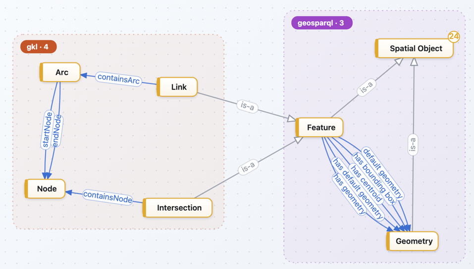
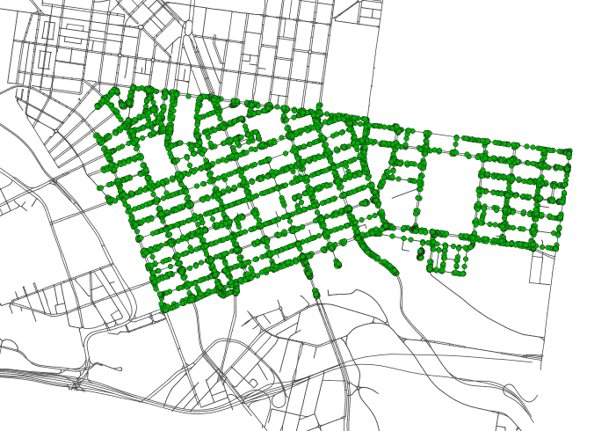
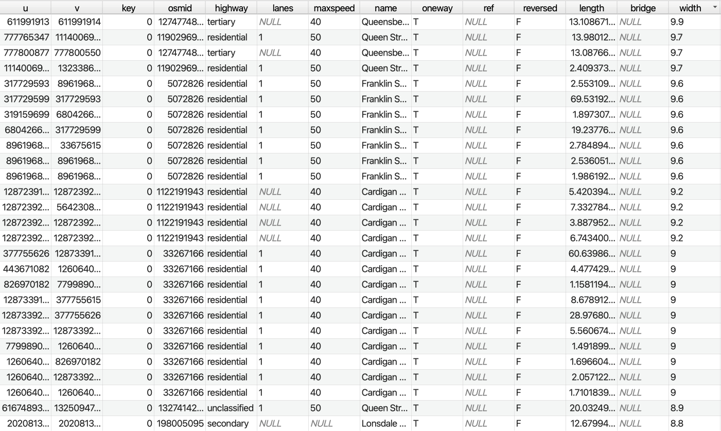
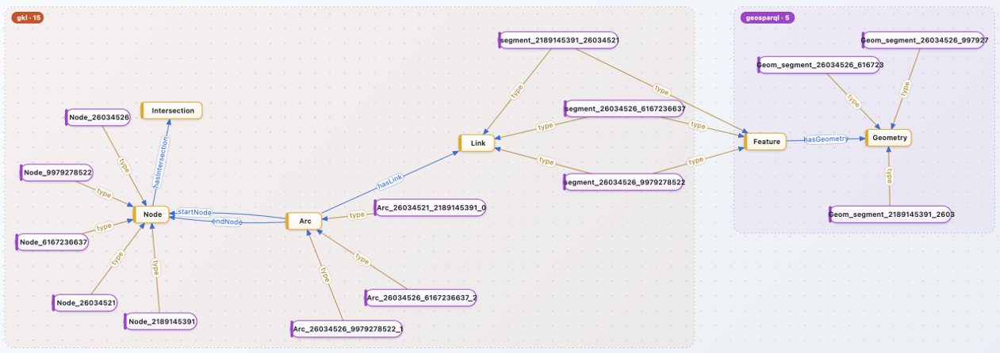

# SRTO: The Simple Routable Transport Ontology 
This GitHub repository demonstrates the **Simple Routable Transport Ontology (SRTO)**, an ontology developed to represent and link concepts required to enable routing through road transport networks. The main purpose of SRTO is to provide a simple and practical semantic representation of road networks, focusing primarily on the concepts and relationships required for routing through road transport networks. SRTO builds on concepts previously developed and used in several transport and geospatial ontologies, including the [Transportation System Ontology](www.enterpriseintegrationlab.github.io/icity/TransportationSystem/TransportationSystem_1.2/doc/index-en.html, KM4City, the Ontology for Transportation Networks (OTN), and GeoSPARQL. By drawing on these existing ontological approaches, SRTO aims to provide a simplified representation of road networks while maintaining the key concepts and relationships required for routing applications.

The repository brings together the main components required for developing and demonstrating the SRTO ontology and its associated road network knowledge graph. These components include ontology engineering, road network data, the road network knowledge graph, and the tools used to develop and construct the ontology and knowledge graph.

## Ontology Engineering
The ontology engineering component focuses on the design and development of SRTO, including the core concepts, relationships, and properties required to represent a routable road network. We reuse some of core ocncepts fro transport rad network representation from the following ontologies: Transportation System Ontology, KM4City, the Ontology for Transportation Networks (OTN), and GeoSPARQL. 

## Road Network Data
The road network data component provides the source data used to populate and demonstrate the ontology. These data are transformed and semantically enriched using the concepts defined in SRTO to create a road network knowledge graph.

  

## Road Network Knowledge Graph (RNKG) 
The knowledge graph provides a semantic representation of the road network in which relevant entities and their relationships are explicitly connected, supporting querying and routing-related applications.

  

## Tools and Technologies
We use the following tools and technologies for ontology development, semantic enrichment, data integration, knowledge graph construction, and interaction with the resulting knowledge graph:  

- Python 
- GraphDB 
- Apache Jena

## Web Interface 

## Acknowledgements
This development of SRTO was led by Prawal Lohani and Nenad Radosevic, with contributions from all of the researchers at the [RMIT Geographic Knowledge Lab](http://gkl.rmit.melbourne/about): Alexis Horde Vo, Nayomi Ranamuka, Ozzy Yaguang Tao, and GKL Director [Prof Matt Duckham](https://academics.rmit.edu.au/matt-duckham). 
