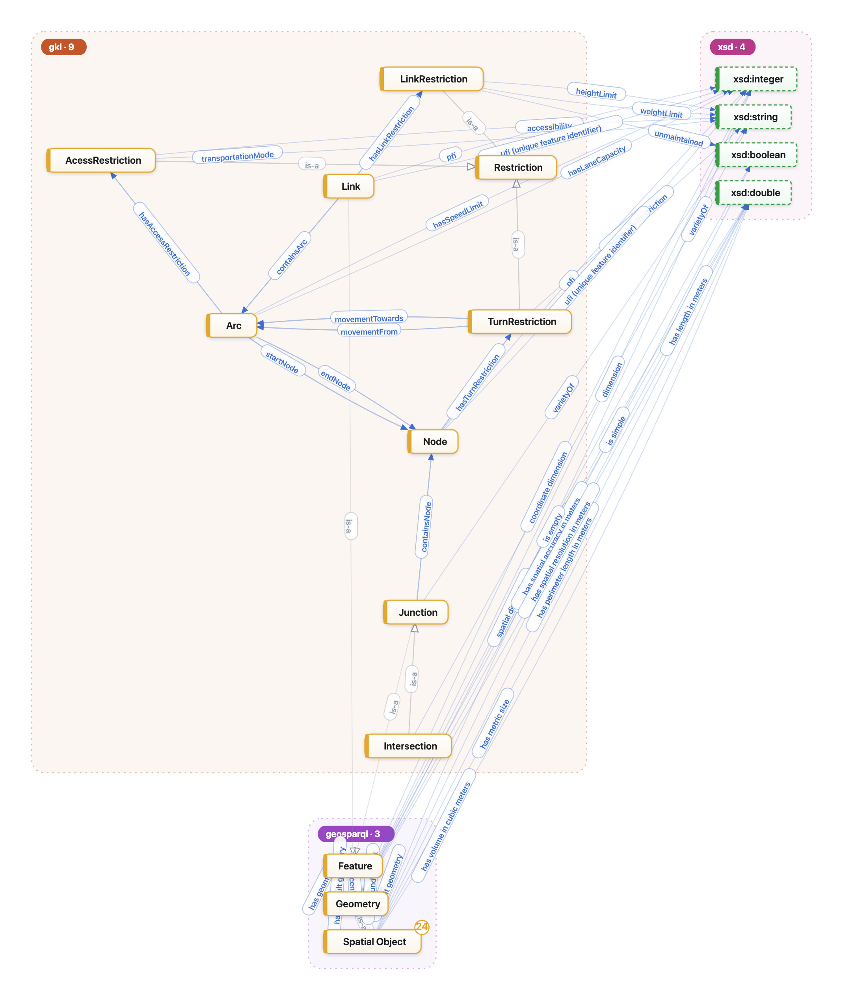

# SRTO Ontology Engineering 
The ontology engineering process usually involves multiple steps. The first step is to define a set of competency questions. The SRTO ontology aims to answer some of the following example questions: 
- Can you provide the route between A and B? 
- What are adjacent nodes to a particular node? 
- Show me all the intersections where I can turn, right ? 
- What is the speed limit on a particular road? 
- What is the maximum flow over the particular road? 
- What are the roads that allow trucks during the night? 
- Which road segment meets at a particular junction? 
- Which lane should I turn left? 
- What is the speed limit on a particular road at a specific time?  
## Distinguishing Topology and Geometry representation 
The second step involves designing an ontology that models the real-world domain. In this case, an important aspect is to distinguish transport network topology concepts, such as nodes and arcs, from the physical and geometric representations of the transport network, such as intersections, junctions, and road segments.For geometric representations, we reuse the GeoSPARQL ontology and its classes for representing different spatial objects using geometries such as points and lines. For physical and gemotric representations we introduced two new classes *Link* and *Junction*. For topological concepts, we introduce two new classes: *Arc* and *Node*.
## Adding restrictions
The next step is to incorporate different types of restrictions for routing through the transport network. We introduce a new class, *Restriction*, and several object properties, including *hasTurnRestriction* and *hasAccessRestriction*. These new classes and properties enable the modelling of routing constraints and support route planning between different locations.

